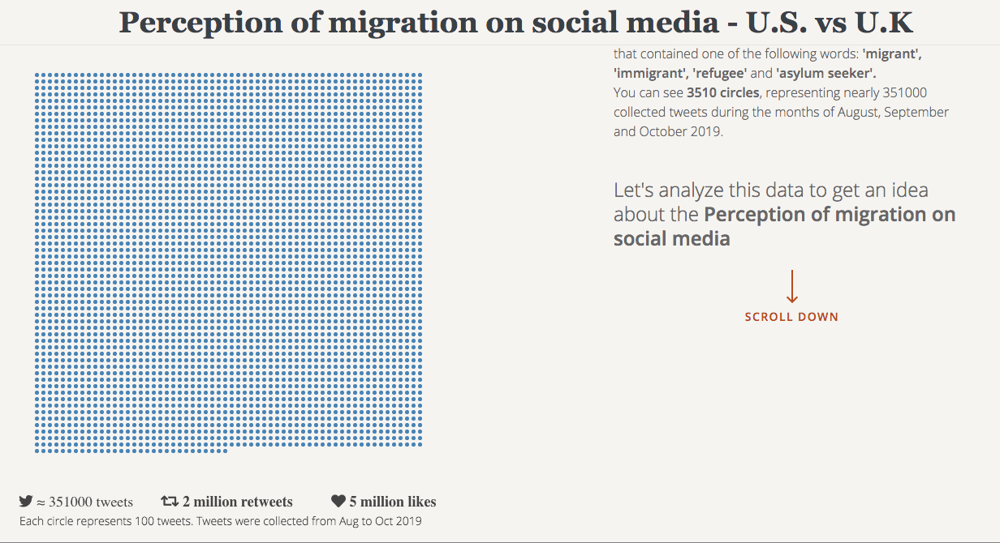

## Perception of migration on social media - U.S. vs U.K

## Details

Visual Analytics project for the [BDMA course by Petra Isenberg ](https://www.aviz.fr/TeachingVA2019/Schedule) at CentraleSupelec

January 2020

## Overview

70.8 million people are forcibly displaced worldwide for reasons such as poverty or war.
We collected nearly 351,000 migration-related tweets during the months of August, September and October from the United States and the United Kingdom.
Social media is a rich source of information to observe and understand the views of the general population towards migrants and refugees: how much the matter concerns them, how they feel about it and what events are perceived as particularly important.

## Preview Images

You can find some preview images with different resolution at ./images/. The folder also contrains the .gif above.

## Source Data set

The original dataset consists of just of tweets IDs. This is because according to Twitter’s terms of service «if you provide Twitter Content to third parties, (...), you will only distribute or allow download of Tweet IDs, Direct Message-IDs, and/or User IDs». You can find it in ./data/tweet_ids

## Developers

* **Eugen Patrascu**
* **René Gómez**
